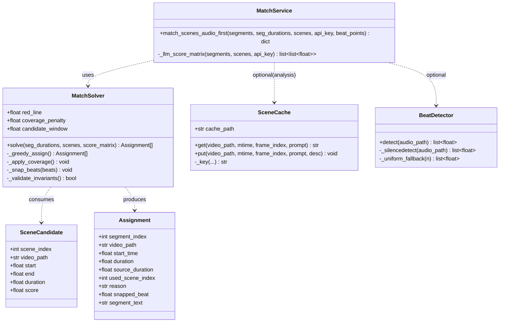
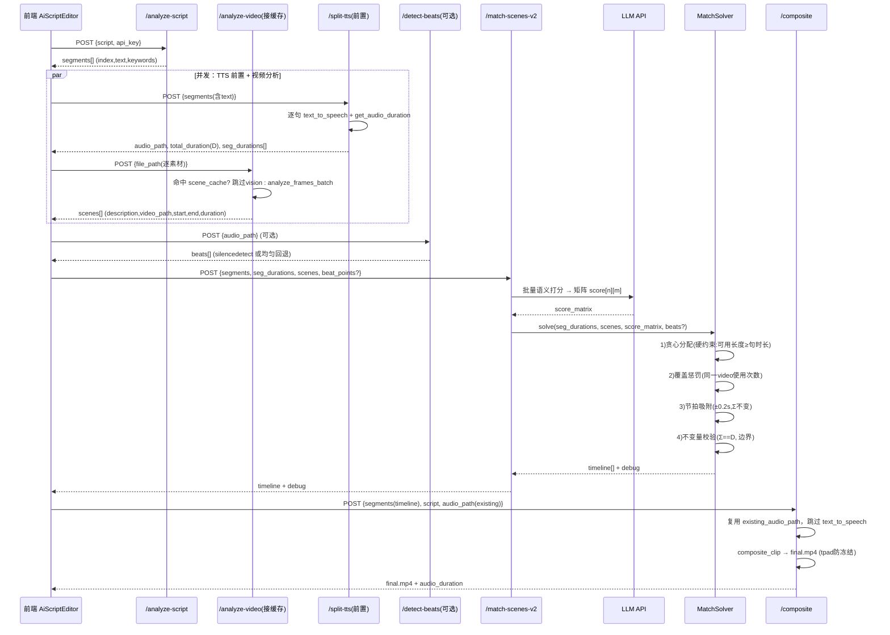

# 设计文档：音频优先混合匹配（Audio-First Match / V1）

> 增量设计文档，配合 `docs/prd-match-audio-first.md` 使用。
> 目标：把"先匹配后配音"改为"先配音后匹配"——TTS(split-tts) 前置拿到每句真实时长 → 语义匹配挑片（保留为首选标准）→ 约束感知求解器在硬约束下做最优分配 → 叠加素材覆盖最大化 → 可选节拍切点 → 场景描述缓存。
> 语言：中文。所有行号以本次实际读到的代码为准（与 PRD 引用不一致处已在文中标注）。

---

## 1. 实现方案 + 框架选型

### 1.1 核心难点

| 难点 | 旧实现根因 | 本方案解法 |
|---|---|---|
| 素材用不尽 | `match_scenes_to_segments` 每片段挑 1 个 best_scene（1:1），最多用 3-5 个素材 | 语义分矩阵（每句 × 每素材）+ 覆盖惩罚，鼓励铺开 |
| 结尾冻结 | 匹配阶段时长用 AI 猜的 `duration_hint`，Σ≠真实口播时长，合成按 `-t audio_dur` 对齐导致视频更短 | **直接以 split-tts 的真实 `seg_durations` 作为每段时长**；Σ 天然 == total_duration，从构造上消除冻结 |
| 边界溢出 | `start = sc.get("start")` 不校验 `start+dur≤素材长` | 求解器硬约束 `dur_i ≤ scene.available`，并输出 `source_duration` 供校验 |

### 1.2 算法选型（关键决策）

- **语义分矩阵**：由 LLM 单次批量产出「每句 × 每素材」相关分矩阵（0-1 标度），**API 调用次数不高于旧方案**（旧方案也是一次匹配调用）。矩阵即"语义匹配为首选标准"的载体。
- **约束求解器**：**贪心 + 局部回退（greedy with local backoff）**，纯 Python 标准库实现。
  - 为何不引入匈牙利/最小费用流：V1 规模很小（句数 n ≤ 8，素材场景数 m ≤ ~30），贪心在此规模下能稳定拿到高质量解，且可单测、零依赖、易调试。升级路径见 §8 Q5。
  - **时长不变量的巧妙之处**：旧方案在匹配后才量时长、靠重估时长凑数；本方案在匹配**前**已用 TTS 量出每句真实时长 `seg_durations[i]`，求解器直接令 `duration[i] = seg_durations[i]`，于是 `Σduration == total_duration` **由构造保证**，无需任何"求解时长"的步骤，也无需重新平衡各段时长。
- **覆盖最大化**：在相关分矩阵上叠加「按源视频使用次数」的惩罚项；仅在"分差 ≤ 候选窗口"的可替换集合内，才用惩罚把分配推到更少使用的素材。低于语义红线的素材绝不强制匹配。
- **节拍切点（P1）**：复用现有 ffmpeg（`silencedetect` 滤镜，零新依赖）检测口播气口，把切点做 ±0.2s 微调吸附。
- **场景缓存（P1）**：复用既有 ffmpeg + 现状 TTS 缓存的"md5 落盘"风格，按 `(video_path, mtime, frame_index, prompt)` 哈希，文件 JSON 索引。

### 1.3 框架/库结论

- **不引入任何新框架、不新增 API、不新增重型依赖**。
- 复用既有：`/split-tts`（已有，L505）、`composite_clip` + `video_service._ffmpeg`（L26）、`analyze_frames_batch`（L303）、`get_audio_duration`、`_probe_audio_stream`。
- `silencedetect` 是 ffmpeg 内置滤镜，**无需安装任何东西**。
- 求解器用标准库；`numpy` 项目虽已装（requirements.txt L8），但本规模纯 Python 更简洁、零心智负担，**默认不依赖 numpy**（见 §6）。

---

## 2. 文件列表及相对路径（增量）

| 文件 | 动作 | 职责（一句话） |
|---|---|---|
| `backend/services/match_solver.py` | **新增** | 约束感知求解器：语义分矩阵 → 贪心分配 + 覆盖惩罚 + 边界硬校验 + 节拍吸附 + 不变量校验，返回 timeline。 |
| `backend/services/beat_detect.py` | **新增** | ffmpeg `silencedetect` 封装，返回气口时间列表；无静音时回退均匀切点。 |
| `backend/services/scene_cache.py` | **新增** | 场景描述缓存：按 `md5(video_path+mtime+frame_index+prompt)` 查/写，落盘 JSON 索引。 |
| `backend/services/ai_service.py` | **修改** | 新增 `match_scenes_audio_first(segments, seg_durations, scenes, ...)` 编排 LLM 打分 + 求解器 + 可选节拍/缓存；放宽 `analyze_script` 粒度（L347 prompt "3-5段"→"5-8 自然断句"）。 |
| `backend/routes/ai_editing.py` | **修改** | 新增 `/match-scenes-v2`、`/detect-beats`；`/analyze-video` 接 `scene_cache`；`/composite` 确保传 `existing_audio_path`；重写 `/full-pipeline` 为 v2 编排（修复 L400 既有 bug）。 |
| `src/renderer/components/analysis/AiScriptEditor.tsx` | **修改** | 前端编排：把 split-tts 前置到匹配前，状态流转透传 `seg_durations/total_duration/audio_path`，调用 `/match-scenes-v2`。 |
| `src/renderer/components/render/ExportConfirm.tsx` | **不改（已就绪）** | 已正确透传 `audio_path`（L175）→ 后端 composite 复用已有音频，无需改动。仅建议补充覆盖 N/7 提示（可选，见 §8 Q6）。 |

> 说明：前端除 `AiScriptEditor.tsx` 外，`TimelineEditor.tsx` / `ExportConfirm.tsx` 消费的是 `timeline` 形状（含 `video_path/start_time/duration/segment_text/source_duration`），与 v2 输出结构一致，**无需改动**。

---

## 3. 数据结构与接口（类图 / JSON Schema）

### 3.1 类图（Mermaid）



### 3.2 `/match-scenes-v2` 入参 Schema

```json
{
  "segments": [
    { "index": 0, "text": "大家好…", "keywords": ["外观","惊艳"], "duration_hint": 3.0 }
  ],
  "seg_durations": [3.2, 2.8, 4.1],
  "scenes": [
    { "description": "红色礼盒特写", "video_path": "D:/m/1.mp4", "start": 0.0, "end": 5.0, "duration": 5.0 }
  ],
  "api_key": "",
  "beat_points": [1.2, 4.5],
  "options": { "red_line": 0.35, "coverage_penalty": 0.05, "candidate_window": 0.1 }
}
```
- `segments`：与 `/split-tts` 使用**同一数组**（来自 analyze-script），保证 `seg_durations[i]` ↔ 矩阵第 i 行严格对齐。
- `seg_durations`：来自 split-tts，长度 == segments 长度，单位为秒，Σ == total_duration。
- `scenes`：来自 analyze-video（含缓存），每个场景自带 `video_path/start/end/duration`。
- `beat_points`：可选，来自 `/detect-beats`。
- `options`：可选，覆盖默认参数（见 §8 Q1/Q2）。

### 3.3 `/match-scenes-v2` 出参 Schema

```json
{
  "code": 0,
  "message": "success",
  "data": {
    "timeline": [
      {
        "segment_index": 0,
        "video_path": "D:/m/1.mp4",
        "start_time": 0.0,
        "duration": 3.2,
        "source_duration": 5.0,
        "used_scene_index": 2,
        "reason": "score=0.82 覆盖优先(视频3首次使用)",
        "snapped_beat": null,
        "segment_text": "大家好…"
      }
    ],
    "total_duration": 15.0,
    "debug": {
      "used_materials": 5,
      "total_materials": 7,
      "feasible": true,
      "red_line": 0.35,
      "coverage_penalty": 0.05,
      "backoff_segments": []
    }
  }
}
```
**不变量（必须成立）**：
1. `Σ timeline[i].duration == total_duration`（由 `duration[i]=seg_durations[i]` 构造保证）。
2. 每段 `start_time + duration ≤ source_duration`（求解器硬约束）。
3. `len(timeline) == len(segments)`。

### 3.4 `/detect-beats` Schema

```json
// 入参
{ "audio_path": "D:/tmp/tts/concat_xxx.mp3" }
// 出参
{
  "code": 0,
  "data": {
    "beats": [ { "time": 1.234, "score": -32.1 }, { "time": 4.501, "score": -28.7 } ],
    "count": 2,
    "fallback": false
  }
}
```
- `beats[].time`：静音段中心（秒），即推荐切点。
- `fallback=true` 表示音频无静音、回退到均匀切点。

### 3.5 求解器内部数据结构

```python
# 语义分矩阵：score_matrix[i][j] ∈ [0,1]，i=句, j=场景
score_matrix: list[list[float]]

# 场景候选（由 scenes 派生，携带可用长度与源视频）
SceneCandidate = {
    "scene_index": int,
    "video_path": str,
    "start": float,          # 选取起点（默认 scene.start）
    "end": float,            # 素材可用终点（默认 scene.end）
    "available": float,      # = end - start，硬约束用
    "video_id": str,         # 用于覆盖惩罚的"源视频"聚合键
}

# 分配结果（求解器产出，再包装为 Assignment）
assignment: dict[int, int]   # segment_index -> scene_index

# 覆盖统计
usage_count: dict[str, int]  # video_id -> 已被分配次数
```

### 3.6 缓存结构（`scene_cache.py`）

- **落盘位置**：`{TEMP_DIR}/ai_scene_cache.json`（单文件 JSON 索引，与 generate-tts 的"md5 落盘"风格一致）。
- **Key**：`md5(f"{video_path}|{mtime:.3f}|{frame_index}|{prompt}")`。
- **Value**：该帧的 vision 描述文本（字符串）。
- **失效策略**：key 内含 `mtime`，素材被修改（mtime 变化）→ key 变化 → 自动 miss → 重新分析；frame_index/prompt 变化同理。

```json
{
  "a1b2c3d4e5...": "红色礼盒在木桌上特写，暖光",
  "f6g7h8i9j0...": "主播手持产品讲解，背景虚化"
}
```

---

## 4. 程序调用流程（时序图，Mermaid）



> 注：并发段中，`/split-tts` 内部对每句 TTS 已可并发（复用 `_retry_with_backoff` + 信号量思路），`/analyze-video` 多素材 vision 分析本就是并发（见 `analyze_frames_batch` L303 的 `asyncio.gather`）。前端用 `Promise.all`/并行 `await` 即可。

---

## 5. 任务列表（有序、含依赖、按实现顺序）

> 任务均标注依赖与前后置；工程师可逐条执行。

### T1 新增 `backend/services/match_solver.py`（纯函数，可单测）
- **职责**：约束感知求解器核心。
  - `MatchSolver.solve(seg_durations, scenes, score_matrix, beat_points=None, options=...)` → `Assignment[]`。
  - 硬约束：① `available_j ≥ seg_durations[i]`；② `start+duj ≤ source_duration`（start 默认 scene.start）；③ 输出 Σ==D（由 `duration=seg_durations[i]` 保证）。
  - 覆盖最大化：`usage_count[video_id]` 惩罚，仅在 `|score - best| ≤ candidate_window` 的可替换集合内择优。
  - 局部回退：某句在红线 + 长度双重约束下无候选 → 放宽红线至 0（取长度可行内最高分）；若仍无长度可行候选 → 标记 `feasible=False` 并记入 `debug.backoff_segments`。
  - 节拍吸附：若有 `beat_points`，对各段边界做 ±0.2s 微调（两相邻段时长等量反向调整，Σ 不变，且满足 `end` 约束）；无则跳过。
  - 返回前 `_validate_invariants()` 断言不变量。
- **源文件**：`backend/services/match_solver.py`（新增）。
- **依赖**：无。
- **优先级**：P0。

### T2 新增 `backend/services/beat_detect.py`（P1）
- **职责**：`BeatDetector.detect(audio_path)` → `list[float]`（静音中心时间）。封装 `ffmpeg -i audio -af silencedetect=... -f null -`，解析 `silence_start`/`silence_end` 取中点；无静音 → `_uniform_fallback` 返回基于 total_duration 的均匀切点，`fallback=True`。
- **源文件**：`backend/services/beat_detect.py`（新增）。
- **依赖**：无（复用 `video_service._ffmpeg`）。
- **优先级**：P1。

### T3 新增 `backend/services/scene_cache.py`（P1）
- **职责**：`SceneCache.get/put(video_path, mtime, frame_index, prompt)` 读写 `{TEMP_DIR}/ai_scene_cache.json`；key=`md5(...)`，mtime 参与 → 自动失效。`get` 返回 `Optional[str]`。线程安全用简单文件锁/原子写。
- **源文件**：`backend/services/scene_cache.py`（新增）。
- **依赖**：无。
- **优先级**：P1。

### T4 修改 `backend/services/ai_service.py`
- **职责**：
  - 新增 `match_scenes_audio_first(segments, seg_durations, scenes, api_key="", beat_points=None, options=None)`：调用 T1 求解器；可选先 `BeatDetector.detect`（若 beat_points 未传但开关开）；返回 `{timeline, total_duration, debug}`。语义分矩阵由内部 `_llm_score_matrix(segments, scenes, api_key)` 经单次 LLM 调用产出（prompt 要求返回 `score_matrix[i][j]`）。
  - 放宽 `analyze_script`（L347 prompt："3-5段"→"按语义自然断句，5-8 段，每段对应一句口播"），并相应下调 `_force_split_segments` 默认 `min_count`（L402）以对齐 5-8 粒度；`duration_hint` 仅作 LLM 上下文提示，**不进入时长基准**（见 §7）。
- **源文件**：`backend/services/ai_service.py`（修改）。
- **依赖**：T1、T2、T3。
- **优先级**：P0。

### T5 修改 `backend/routes/ai_editing.py`
- **职责**：
  - 新增 `POST /match-scenes-v2`：入参见 §3.2，调 `match_scenes_audio_first` 返回 §3.3。
  - 新增 `POST /detect-beats`：调 `BeatDetector.detect`。
  - 修改 `/analyze-video`（L73）：在 `analyze_frames_batch` 前按 `SceneCache` 查缓存（key 含 `video_path+mtime+frame_index+prompt`），命中则跳过 vision。
  - `/composite`（L141）：确认 `existing_audio_path` 优先（已有，L176 逻辑保留）；在 composite 前打印"输入总时长 vs 音频时长"一致性日志（P2）。
  - **重写 `/full-pipeline`**（L343）：改为 v2 编排 = analyze-script → split-tts(前置) → analyze-video(缓存) → [detect-beats] → match-scenes-v2 → composite(existing_audio_path)。**修复 L400 既有 bug**（旧代码把 `all_descriptions`/`all_frame_paths` 错当成 `scenes`/`api_key` 位置参数，且读 `item["scene_path"]` 旧匹配器根本不产出该字段）。
- **源文件**：`backend/routes/ai_editing.py`（修改）。
- **依赖**：T1、T2、T3、T4。
- **优先级**：P0。

### T6 修改 `src/renderer/components/analysis/AiScriptEditor.tsx`（前端编排，最小化）
- **职责**（改 `handleRun`，L134）：
  1. analyze-script → `segments[]`。
  2. **并发**：`/split-tts`(前置，传 `segments` 的 `text`) 与 `/analyze-video`(逐素材，含缓存) 并行；split-tts 回传 `audio_path/total_duration/seg_durations` 存入 store（`setAudioDuration`/`setAudioPath` 已存在）。
  3. 可选 `/detect-beats(audio_path)` → `beats`。
  4. `/match-scenes-v2`（传 `segments + seg_durations + scenes + beats`）→ `timeline`（含 `segment_text`/`source_duration`）。
  5. 步骤文案改为"基于真实口播时长智能匹配"；可选在结果区展示"已使用 N/7 素材"（见 §8 Q6，低优先）。
  - `setTimeline` 直接用 v2 的 timeline；`ExportConfirm` 已透传 `audio_path` → composite 复用音频，**无需改**。
- **源文件**：`src/renderer/components/analysis/AiScriptEditor.tsx`（修改）。
- **依赖**：T5（后端端点就绪）。
- **优先级**：P0（编排）/ P2（覆盖提示）。

### T7 回归测试与真实 ffmpeg 验证（交 QA，列出验证点）
- **职责**：验证不变量与冻结消除。
- **验证点**：
  1. 给定 7 素材(≈35s) + 口播(≈15s)，`timeline` 各段 `duration` 之和 == `total_duration`，误差 ≤ 1 帧(≈0.04s)。
  2. 每段 `start_time + duration ≤ source_duration`。
  3. 合成视频时长 == 音频时长（无冻结/黑场/拉伸）。
  4. 同批素材二次 `/analyze-video` 命中 `scene_cache`（不发起 vision）。
  5. `/detect-beats` 在静音音频返回切点；无静音回退均匀且不报错。
  6. 覆盖统计 `used_materials` ≥ 旧方案，且在红线约束下尽量铺开。
  7. `/full-pipeline` 端到端跑通（修复后）。
- **源文件**：`backend/tests/`（新增测试，属 QA）。
- **依赖**：T1–T6。
- **优先级**：P0（验收）。

---

## 6. 依赖包列表

**零新增依赖。**

| 组件 | 依赖 | 是否需要新增 |
|---|---|---|
| 求解器 `match_solver.py` | Python 标准库（`dataclasses`/`typing`） | 否 |
| 节拍 `beat_detect.py` | `video_service._ffmpeg`（ffmpeg 内置 `silencedetect`） | 否 |
| 缓存 `scene_cache.py` | `hashlib`/`json`/`os`（标准库） | 否 |
| 语义打矩阵 | 既有 LLM HTTP（`httpx`，已装） | 否 |
| 合成 | 既有 `composite_clip` | 否 |

> `numpy==2.1.3` 已在 `requirements.txt` L8，但本求解器规模（≤8×≤30）用纯 Python 即可，默认**不引入 numpy**，降低耦合与类型摩擦；若工程师偏好可用 numpy 做矩阵运算，项目已具备，无需新增安装。

---

## 7. 共享知识（跨文件约定）

1. **时长基准唯一**：所有时间轴时长一律以 `/split-tts` 返回的 `seg_durations[i]` 为准。**禁止**再用 `duration_hint` 作为时长基准（它仅作 LLM 上下文提示）。`Σ seg_durations == total_duration` 由 split-tts 保证。
2. **Windows 路径转义**：所有传给 ffmpeg 的素材路径统一经 `p.replace("\\","/").replace(":","\\:")` 处理（见 `video_service.py` L340/L509 既有约定）；缓存 key 用原始 `video_path` + `mtime`，不做转义。
3. **不变量（match-scenes-v2 输出必须满足）**：`Σ timeline[i].duration == total_duration` **且** 每段 `start_time + duration ≤ source_duration`。求解器 `_validate_invariants()` 断言。
4. **segments 同一性**：传入 `/split-tts` 与 `/match-scenes-v2` 的 `segments` 必须是**同一数组**（均来自 analyze-script），保证 `seg_durations[i]` ↔ 矩阵第 i 行 ↔ `timeline[i]` 严格对齐。
5. **语义匹配为首选标准**：求解器先按相关分矩阵取最优，覆盖惩罚仅在"分差 ≤ candidate_window 的可替换集合"内生效；低于 `red_line` 的素材绝不强制匹配（回退也只取长度可行内最高分）。
6. **音频复用**：`/composite` 收到 `audio_path` 时**必须**跳过 `text_to_speech`，直接复用（既有 L176 逻辑保持）；v2 编排始终把 split-tts 的 `audio_path` 透传到 composite。
7. **响应格式**：所有端点延续 `{code, message, data}`（见 `ai_editing.py` L47 `_ok`/`_err`）。
8. **缓存 key 失效**：`scene_cache` key 含 `mtime`，素材修改/重导即失效；frame_index 或 prompt 变化同理。
9. **节拍吸附守恒**：吸附只移动切点（等量反向调整相邻两段时长），**绝不改变 Σduration**，并受 `scene.end` 约束。

---

## 8. 待确认问题（8 问 → 推荐默认值 + 理由）

按"自主推进"偏好，能定的全部给默认决策；仅把真正阻塞项挑出（见 §8 末）。

### Q1 语义相关分阈值红线（P0-2）
- **推荐默认**：绝对阈值 `red_line = 0.35`（0-1 标度）。
- **理由**：相关分矩阵由 LLM 产出，初版缺乏标定样本，0.35 是保守起点——高于"弱相关"，低于"强相关"。同时支持**相对标定**作为补充：当某句所有素材最高分都很低时，用 `max(0.35, 0.6 * max_i)` 退化为"相对最大值的 60%"，避免整句因绝对阈值过高而全部落空。
- **标定方法**：跑 10-20 条真实文案 + 素材，统计每句 `max(score)` 分布，取"明显下跌拐点"作为绝对阈值；首版先固定 0.35，上线后按样本微调。

### Q2 覆盖惩罚系数 / 候选窗口
- **推荐默认**：`coverage_penalty (λ) = 0.05`；`candidate_window (δ) = 0.10`。
- **理由**：
  - `δ=0.10`：相关分差 ≤0.1 视为"可替换"，在此集合内才用惩罚把分配推到更少使用的源视频。
  - `λ=0.05`：源视频每多被使用 1 次，扣 0.05 分。在 [0,1] 标度下，这足以在"分差≤0.1"的近邻集合内把选择导向未使用素材，又不会压过真实语义差异（>0.1 的差异仍由语义主导）。
- 二者均经 `options` 可运行时覆盖（见 §3.2）。

### Q3 旧 `/match-scenes` 兼容
- **推荐默认**：**保留旧端点不删**，作为"快速模式/回退"；前端默认走 v2（`/match-scenes-v2`）。
- **理由**：零成本保留，便于 A/B 与异常回退；待 v2 稳定后再评估下线（见 §8 末唯一待确认项）。

### Q4 `analyze-script` 粒度
- **推荐默认**：放宽到 **"按语义自然断句，5-8 段，每段对应一句口播"**（修改 L347 prompt），并同步把 `_force_split_segments` 默认 `min_count`（L402）下调到 5，保证句数 ∈ [5,8]。
- **匹配单元对齐**：放宽后的 `segments` 与 split-tts 的 `seg_durations` **一一对应**（同一数组），即"匹配单元 = TTS 单元 = 一句口播"。粒度更细 → 分配单元更多 → 素材覆盖率更高，且不违背"语义匹配为首选标准"。

### Q5 求解器选型
- **推荐默认**：**贪心 + 局部回退（v1 足够）**。
- **论证 v1 够用**：n≤8、m≤~30、硬约束简单（长度 + 边界），贪心按"难度"（时长最长 / 可行候选最少者优先）排序后分配，能在近邻内做覆盖铺开，结果稳定且可解释、可单测。
- **升级触发条件**（届时再动）：① 句数/素材规模显著增大（>20 句或 >100 场景）导致贪心明显次优；② 需要跨段"共享同一素材不同区间"的全局最优；③ 出现系统性覆盖不足。升级目标：匈牙利算法 / 最小费用最大流（min-cost flow），届时求解器接口 `solve()` 签名不变，仅内部替换。

### Q6 前端步骤 UI / 覆盖反馈
- **推荐默认（最小化）**：
  - 步骤文案改为"**基于真实口播时长智能匹配**"（替换原"AI 匹配画面"）。
  - 覆盖反馈**标为可选（P2）**：在结果区加一个 Chip `已使用 N/7 素材`，数据来自 `/match-scenes-v2` 的 `debug.used_materials/total_materials`。
- **理由**：满足"可观测性"但不阻塞 V1 主干；N 来自后端 debug，前端零计算。

### Q7 缓存介质
- **推荐默认**：**文件落盘 JSON 索引**，路径 `{TEMP_DIR}/ai_scene_cache.json`，key=`md5(video_path|mtime|frame_index|prompt)`，value=描述文本。
- **理由**：与现有 generate-tts 缓存（md5 落盘）风格一致；单文件索引便于查看/清理；`mtime` 入 key 即实现自动失效，无需额外 TTL 逻辑。

### Q8 `/full-pipeline` 既有 bug
- **推荐默认**：**在本次重构中一并理顺为 v2 编排**（T5 重写）。
- **确认的根因**（实际代码 L400）：
  - 调用 `match_scenes_to_segments(segments, all_descriptions, all_frame_paths)` 位置参数错位——把描述字符串当 `scenes`、把帧路径当 `api_key`；
  - 随后 L409 `item.get("scene_path")` 读取旧匹配器从不产出的字段 → 最终 `comp_segments` 几乎为空。
  - 且它从未在匹配前跑 split-tts，时长全靠估算。
  - 重写为 v2 编排后，上述全部消除（TTS 前置、走 v2 矩阵匹配、composite 复用音频）。

---

### 待明确事项（真正需要用户点头的，仅 1 条）

> 结论：**其余 7 问均已给推荐默认值，无需阻塞，按默认值推进即可。**
> 唯一建议在开工前快速确认的是——

- **【可选确认】是否要保留旧 `/match-scenes` 作为长期可切换的"快速模式"，还是 V1 稳定后直接下线？**
  - 推荐：V1 先保留（零成本、可作回退与 A/B），下线决策留到 v2 上线观察 1-2 周后再定。
  - 若你希望"V1 即下线旧端点以减小维护面"，告知一声即可，T5 会改为删除旧端点。

如无异议，按上述全部默认值进入实现（T1→T7）。
